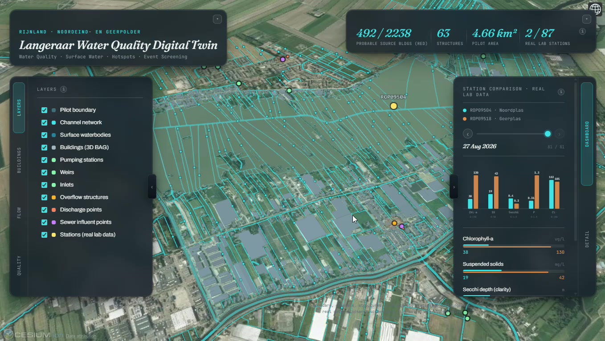

# Space & Water Nexus – Wastewater Challenge

Prototype and research repo for the **Space & Water Nexus Hackathon 2026**, built around the Water Natuurlijk Rijnland challenge: *"Granular insights into wastewater discharges."*

Event info: https://connect.groundstation.space/space-and-water-nexus-hackathon-1-3-october-cometlab



## The prototype: Langeraar Water Quality Digital Twin

When a wastewater discharge is suspected, the hardest question is where it came from. Our prototype is a 3D digital twin of one Rijnland polder (Noordeind- en Geerpolder, about 4.7 km²). It ranks the buildings and structures that are candidate discharge sources, so an inspector can see where to look first. It also compares the two stations that have a real lab record and flags readings that look unusual for their own station.

**Demo video (about 4 minutes): [watch it on Google Drive](https://drive.google.com/drive/folders/1XwvHe2kQh9AZ9n2z4CndadyKkba_hVhe?usp=drive_link)**

It is a screening tool, not proof of a source. Screenshots, the method, the data and the limitations are in [`prototype/README.md`](prototype/README.md).

## The problem

Rijnland already collects water-flow and water-quality data, but it's too coarse to pin down wastewater discharges at their source. That makes it hard to say what happened, when, and where, which limits the authority's ability to investigate illegal or over-permit discharges. This project explores whether combining that existing monitoring data with (near) real-time satellite observations can close some of that gap, or at least narrow down when and where something worth investigating may have happened.

## Repository structure

```
data/
  raw/         Downloaded source layers from Rijnland's Legger services and PDOK, organised by theme
  processed/   Derived study-area boundaries and clipped datasets
  reference/   Layer-priority notes and other reference tables
maps/          Rendered study-area map iterations (PNG)
prototype/     Documentation and screenshots of the Langeraar Water Quality Digital Twin
```

### About the compressed files

A handful of the larger vector layers (anything that was going to land over ~20 MB as plain GeoJSON, plus the combined study-area GeoPackage) are stored gzip-compressed (`.gz`) to keep the repo a reasonable size. To use one:

```bash
gunzip -k path/to/file.geojson.gz
```

Or read the gzip directly without decompressing first, which works fine with GDAL/geopandas:

```python
import geopandas as gpd
gdf = gpd.read_file("data/raw/rijnland_mapserver/01_watercourses/Watergang_vlak.geojson.gz")
```

`data/raw/MANIFEST_study_area.csv` and `data/raw/rijnland_mapserver/MANIFEST.csv` list every downloaded layer with its source service, feature count, and geometry type.

## Data sources

- **Rijnland Legger services** (`Legger_Oppervlaktewater_Vigerend`, wastewater/sewer layers, monitoring locations, water levels, flood defences) — the authority's statutory GIS registers, pulled via their ArcGIS MapServer.
- **PDOK** — national reference layers (provinces, municipalities) and the RSA (Rioolwaterzuivering/sewage treatment) dataset: agglomerations, vulnerable areas, discharge points, WWTPs.

## Study area

The study area and its context layers were clipped from the wider Rijnland dataset; see `data/processed/` for the resulting boundary and buffer files.

## Maps

`maps/` holds the successive iterations of the study-area overview map, ending with `study_area_map_full_layout.png`, which combines a regional locator, an infrastructure close-up, and a full legend.

## Important caveat

Nothing here claims that a satellite signal proves a specific discharge or pollutant source. Satellite data can help flag anomalies and narrow down areas, timing, and possible sources; confirming an actual discharge still needs ground measurements. Results are described as potential anomalies or candidate areas, not confirmed pollution.
