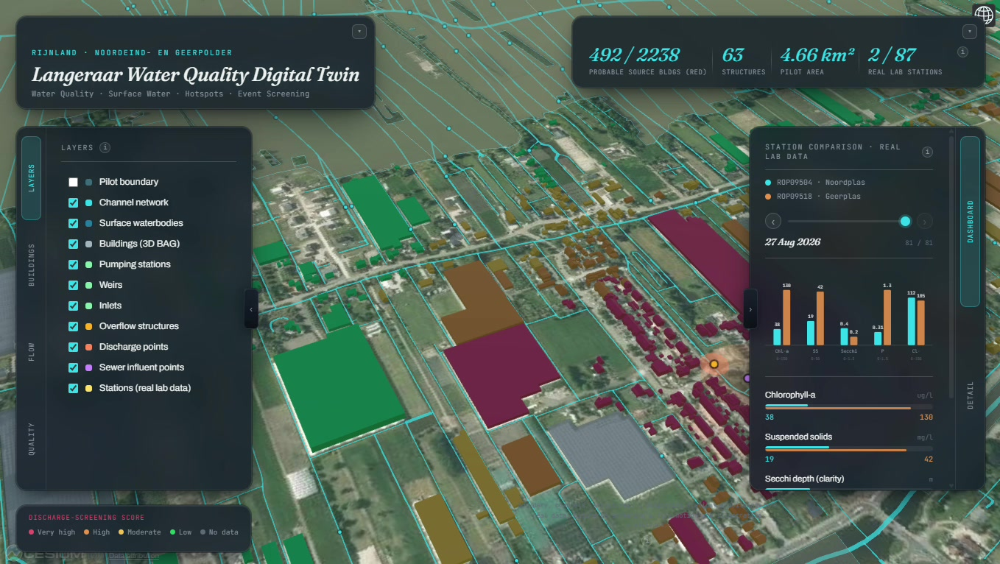
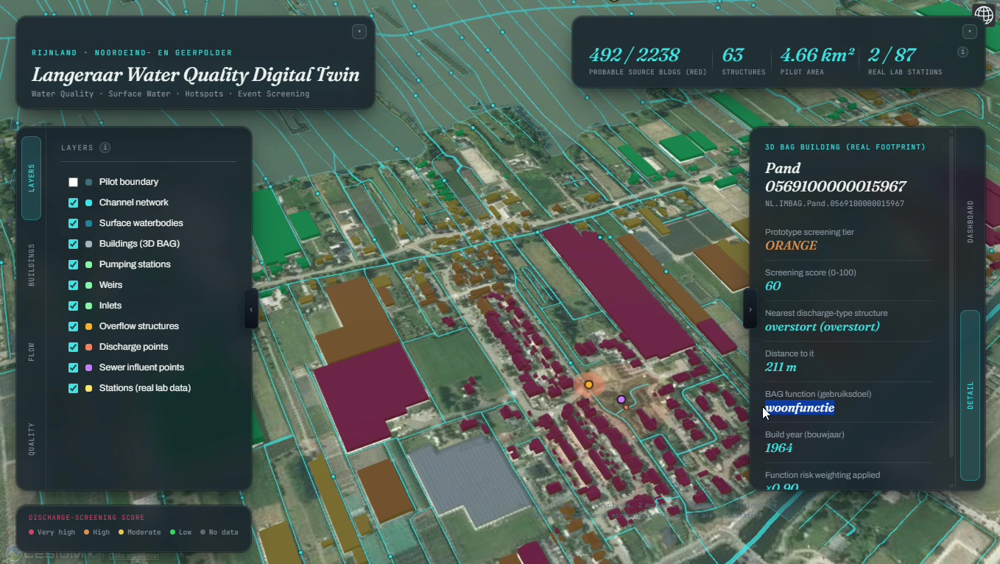
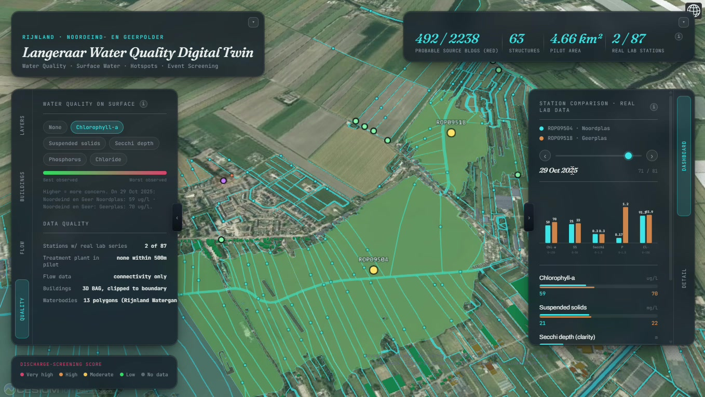
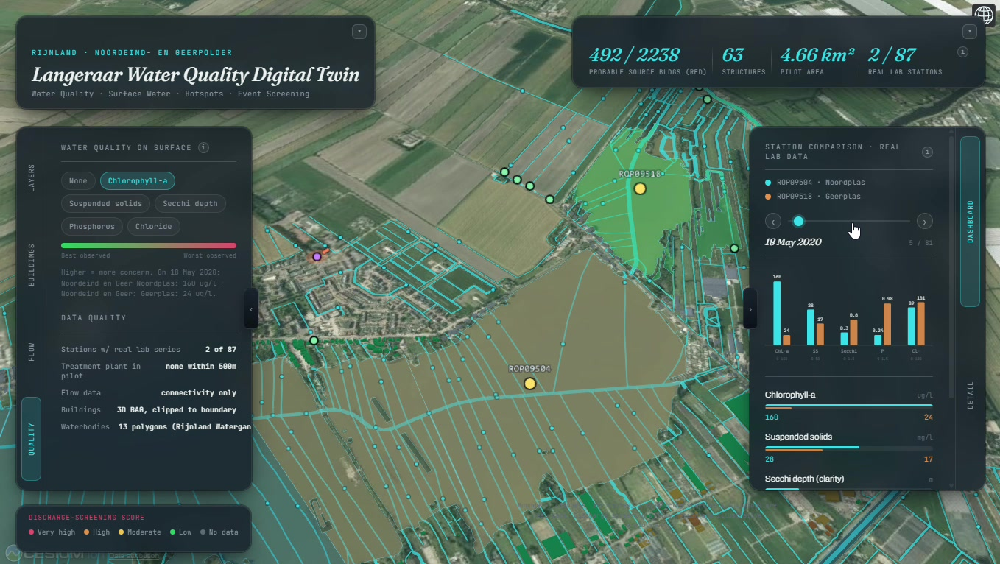
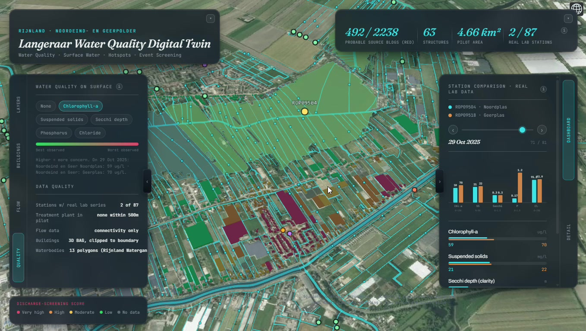

# Langeraar Water Quality Digital Twin

A 3D prototype for one Rijnland polder (Noordeind- en Geerpolder, about 4.7 km²) that helps an inspector decide where to look first when a wastewater discharge is suspected.

**Demo video (about 4 minutes): [watch it on Google Drive](https://drive.google.com/drive/folders/1XwvHe2kQh9AZ9n2z4CndadyKkba_hVhe?usp=drive_link)**

Built at the Space & Water Nexus Hackathon (1 to 3 October 2026) for the Water Natuurlijk Rijnland challenge, *Granular insights into wastewater discharges*.

> **Read this first.** The twin is a screening tool. Its scores and flags are statistical signals built from public data. They are not measurements of a discharge, and they do not prove that any building or structure is a source. Confirming a source needs sampling on the ground.

## Why we built it

Rijnland samples water quality at a limited number of places, weekly to monthly at best. When something goes wrong between two samples, nobody can say where it started. In our pilot area only 2 of the 87 registry stations have a lab record at all, so most of the polder is simply unobserved.

The twin does not try to detect a discharge. It answers a narrower question that can be answered with data that exists today: given where the discharge-type structures are and what each building is used for, which parts of the polder are the most plausible places to start looking, and what does the thin lab record say in the meantime?

## What you can do in it

### 1. Look at the pilot area in 3D

Real building footprints (3D BAG), the channel network, surface waterbodies, pumping stations, weirs, inlets, overflow structures, discharge points and sewer influent points sit on aerial imagery. The top row shows four figures: 492 of 2,238 scored buildings in the top tier, 63 structures, 4.66 km² of pilot area, and 2 of 87 stations with a real lab record.

### 2. Screen buildings for candidate discharge sources

Switching the building colour mode to *Discharge-source screening* colours every scored building by a prototype proximity score. The score is based on two things:

- **Distance** to the nearest of four discharge-type points in the pilot area (one discharge point, one overflow structure and two sewer influent pumping stations). A building within 100 m scores 100. The score decays to 0 at 600 m. Water-level pumps and inlets are left out because they are not discharge sources.
- **What the building is used for** (the BAG `gebruiksdoel`). Industrial use multiplies the score by 1.35, healthcare by 1.25, hospitality by 1.10, offices and shops by 1.05, and purely residential use by 0.90. Missing information stays neutral at 1.00. These weights are prototype choices, not calibrated values.

Of the 3,346 buildings in the pilot, 2,238 sit within 600 m of one of the four points and get a score: 492 very high, 314 high, 585 moderate and 847 low. Buildings further away are shown in grey. Grey means "not evaluated", not "safe".

### 3. Inspect one building

Clicking a building opens its detail card: tier and score, the nearest discharge-type structure and the distance to it, the building's use and build year, and the function weight that was applied. In this example, a residential building from 1964 scores 60 (high tier) because it sits 211 m from an overflow structure. The card shows how the number was reached, so nothing is hidden inside the score.

Weirs, inlets, pumping stations and the other structures open the same kind of card with a one-line plain-language description of what the structure does in a polder water system.

### 4. See water quality on the surface-water layer

Pick a parameter (chlorophyll-a, suspended solids, Secchi depth, phosphorus or chloride) and the lake polygons near a real station are tinted from green to red. Three rules keep this honest:

- Only a lake within 900 m of a real lab station is tinted. Every other lake keeps its neutral colour.
- The colour shows where the reading sits within **that station's own observed range**. It never compares against an official norm.
- The tint follows the date selected on the dashboard slider. If the station has no reading on that date, the lake stays neutral instead of reusing an older value.

Two point stations cannot describe a whole lake surface, so the tint is a prompt to look at the station record, not a map of lake water quality.

### 5. Compare the two real stations, date by date

The dashboard compares the two stations that have a real lab series (ROP09504 Noordplas and ROP09518 Geerplas). The date slider steps through the 81 dates on which either station has a reading, from January 2020 to August 2026. A reading outside the *Tukey fence* of that station's own history (the interquartile range method, 1.5 × IQR beyond the quartiles) is marked "unusual" with a dashed red outline. Across the five parameters and both stations, 15 readings are flagged. "Unusual" means statistically far from the station's own history. It does not mean polluted.

### 6. Both views together

With the building screening and the water quality tint switched on together, an inspector sees the candidate source areas and the nearest lab evidence in one picture.

### Illustrative flow (no screenshot)

An optional layer animates 260 markers along the longer channel segments and small ripples around the four discharge-type points. The source data holds channel connectivity but no validated flow direction or speed, so this layer is labelled **illustrative** everywhere in the interface. It is there to make the water network easier to read, not to show measured or modelled flow.

## Data used

| Data | Source | What we use it for |
|---|---|---|
| Watercourses, waterbody polygons, structures (weirs, inlets, pumping stations), wastewater layers, monitoring station registry | Rijnland ArcGIS MapServer (Legger services) | Channel network, lake polygons, structure and discharge-type points, the 87 registry stations |
| Lab series for stations ROP09504 and ROP09518 | Rijnland water-quality data | Station comparison, unusual-reading flags, lake tint |
| Building footprints, use (`gebruiksdoel`) and build year | PDOK BAG | Screening score and building cards |
| 3D building tiles | 3D BAG (TU Delft and Kadaster, CC BY 4.0) | 3D buildings and ground height |
| Aerial imagery | PDOK | Base map |

The raw layers for the study area are in [`data/`](../data).

## What this shows, and what it does not

| Kind of information | In the prototype |
|---|---|
| Observed | Lab readings at 2 stations. Locations of structures, channels, lakes and buildings. |
| Inferred | The building screening score (proximity plus use). The "unusual" flags (statistics on a station's own history). The lake tint (nearest station, own-range scale). |
| Illustrative only | The flow and discharge motion. |
| Not in the prototype | Satellite observations. Live sensors. Measured flow or direction. A hydraulic model. Validation against known incidents. |

## Technical notes

- CesiumJS 1.146 with Vite, in plain JavaScript. It runs in the browser with no server.
- All processing runs once, offline. The browser loads three small JSON files (scene, building scores, waterbodies).
- The 3D BAG tiles sit about 40 m above the flat ground the scene uses. The twin corrects this with the tiles' own ground-height attribute plus the documented Dutch geoid separation (about 43 m near Amsterdam), so buildings line up with the rooftops in the imagery.
- The application source is not part of this repository yet.

## Next steps

1. **Satellite observations.** Sentinel-2 can add near-real-time context on the wider water bodies. Its 10 m pixels are larger than most polder ditches, so detections would be coarse "possible anomaly" flags, not readings.
2. **Live sensors** at weirs and inlets, to turn the 2 of 87 coverage into a continuous signal.
3. **Measured flow** so the illustrative layer can be replaced by travel times and upstream areas.
4. **Validation** against incidents that Rijnland already knows about, to tune the weights and thresholds.
5. **More polders.** Nothing in the method is specific to this polder.
